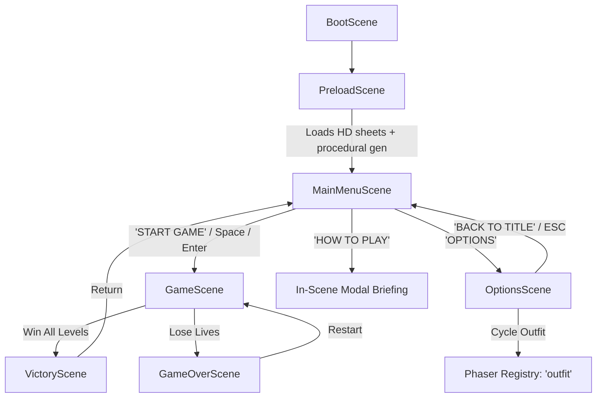

# Dangerous Dave v2: Title Screen & Options Architecture Specification

## 1. Executive Summary & Architectural Overview

The goal of this architectural overhaul was to transition the **Dangerous Dave v2** user interface from a congested dashboard layout into a classic, focused, minimal pixel-art title screen inspired by retro platformer classics (e.g., *Omega Strike*), while offloading secondary configuration tasks to a dedicated settings scene.

### Key Architectural Pillars
1. **Visual Hierarchy & Minimalism**: Single-column vertical flow with a bold hero logo, plain text menu items, Dave character vignette on a small ledge, and CRT atmospheric background. No borders, cards, or clashing per-button color schemes.
2. **Unified Color Language**: Primary interactive accent is bright Cyan (`#00e5ff`), resting on deep twilight slate backgrounds (`#070c14` to `#141f2e`), with WCAG AA-compliant high-contrast text (`#e8f4f8` for headings/active states, `#9fb8c8` for body/descriptions).
3. **Separation of Concerns**: Gameplay launch remains immediate and friction-free in `MainMenuScene`, while cosmetic (outfit skins) and system preferences (audio, display mode) are housed cleanly within `OptionsScene`.
4. **Resilient Asset Pipeline**: Automatic fallback chain between high-definition spritesheets (`dave_hd_${outfit}`) and procedural pixel-art retro textures (`dave_${outfit}_stand`).

---

## 2. Technical Stack & Environmental Constraints

| Component | Specification |
| :--- | :--- |
| **Game Engine** | Phaser 3.88.2 |
| **Language** | TypeScript 5.7.3 (strict mode, `noUnusedLocals: true`) |
| **Bundler & Server** | Vite 6.1.0 |
| **Internal Resolution** | 480 × 256 pixels (`pixelArt: true`, `roundPixels: true`, `antialias: false`) |
| **Aspect Scaling** | `Phaser.Scale.FIT`, `autoCenter: CENTER_BOTH` |
| **Primary Fonts** | `"Courier New", Courier, monospace` (clean bitmap scaling at 1x resolution) |

---

## 3. Design System & Tokens (`src/ui/UITheme.ts`)

```typescript
export const UI_THEME = {
  colors: {
    // Primary Interactive Accent (Cyan)
    accent: 0x00e5ff,
    accentHex: '#00e5ff',
    accentHover: 0x38bdf8,
    accentHoverHex: '#38bdf8',
    goldTitle: '#ffe066',

    // Text Contrast Scale (WCAG AA Compliant against #141f2e)
    textHeading: '#e8f4f8',      // Near-white headings & active labels
    textBody: '#9fb8c8',         // Light gray-blue body & descriptions
    textHighlight: '#67e8f9',    // High-contrast cyan highlights
    textAlert: '#ff6b81',        // Soft bright red for hazards / life alerts

    // Backgrounds & Surfaces
    pageBg: 0x0d1420,
    panelBg: 0x16232e,
  },
  fonts: {
    display: '"Courier New", Courier, monospace',
    ui: '"Courier New", Courier, monospace',
  },
} as const;
```

---

## 4. Scene Pipeline & Lifecycle Flow



### Global State Management
- **Active Outfit**: Managed via `this.registry.set('outfit', outfit)` and passed across scene transitions through `init(data?: { outfit?: OutfitType })`. Supported outfits: `'classic' | 'winter' | 'ninja'`.
- **Audio Mute**: Managed as a global singleton via `SoundManager.getInstance()`. Public API exposes `getMuted(): boolean` and `toggleMute(): boolean`.

---

## 5. Implementation Details: Main Menu (`src/scenes/MainMenuScene.ts`)

### Visual Composition (Top to Bottom, 480 × 256)

1. **Atmospheric Background Layer**
   - **Sky & Horizon**: Base sunset sky texture (`bg_sunset_sky`) at 55% alpha with city/ruins silhouette (`bg_ruin_skyline`) tinted dark slate (`0x101a28`) at 45% alpha.
   - **Gradient Overlay**: Deep midnight slate (`#070c14`) to horizon slate (`#141f2e`) vertical gradient fill.
   - **Particle Embers**: Additive-blended drifting motes with randomized lifespan (4000–7000ms), rising gently upward at low opacity (18% alpha).
   - **CRT Scanlines**: Procedural 1px lines drawn at `y += 2` across the entire viewport at 18% alpha to emulate classic cathode-ray arcade monitors.

2. **Hero Logo (Upper Third, `y: 46`)**
   - Lettering: `"DANGEROUS DAVE"` at `26px bold`.
   - **Vertical Gradient Fill**: Multi-point tint via `.setTint(0xf0fdfa, 0xf0fdfa, 0x00e5ff, 0x00b4d8)` (ice-white top fading into cyan accent bottom).
   - **Outline & Shadow**: Solid dark outline (`#080e16`, 5px stroke thickness) + drop shadow offset down-right (`+2px, +2px`, `#05090f`). No blurred neon halos.
   - **Subtitle**: `"— EPISODE I: REMASTERED —"` rendered in `#9fb8c8` at `y: 68`.

3. **Plain Text Menu List (`y: 112`, Spacing: 24px)**
   - Centered text items: `START GAME`, `OPTIONS`, `HOW TO PLAY`.
   - Zero card containers, borders, or background rectangles.
   - Selected state: text color changes from `#e8f4f8` to `#00e5ff`.
   - **Pointer Arrow (`►`)**: Positioned dynamically 14px to the left of the active text label, animated with a subtle horizontal Sine ease bob (`x: '-=2'`, 450ms).

4. **Character Pose & Ground Ledge (Right Side, `x: 392, y: 180`)**
   - **Ledge**: Clean 68×7px dark stone platform (`0x131f2d`) with a 1px cyan rim (`0x00e5ff`, 70% alpha) and dark drop shadow edge.
   - **Dave Sprite**: Displays the currently active outfit sprite (`1.25x` scale) with a gentle vertical idle breathing bob (`yoyo: true`, 1100ms).
   - **Golden Trophy**: Placed alongside Dave on the ledge with a synchronized vertical float tween.

5. **Corner HUD**
   - Bottom-Left (`x: 16, y: 242`): `'↑↓ SELECT · ENTER CONFIRM'`
   - Bottom-Right (`x: 464, y: 242`): `'v2.0 · BEST: 00000'`

---

## 6. Implementation Details: Options Scene (`src/scenes/OptionsScene.ts`)

### Responsibilities
1. **Outfit / Skin Selector**:
   - Cycles through `'classic'`, `'winter'`, and `'ninja'`.
   - Live character preview sprite with idle floating tween.
   - Displays skin title and thematic lore description.
   - Updates `registry.set('outfit', outfit)` and preserves selection across title screen returns.
2. **Audio Mode Toggle**:
   - Directly toggles `SoundManager.getInstance().toggleMute()`.
   - Displays real-time status: `[ MUTED ]` / `[ ENABLED ]`.
3. **Display Mode Toggle**:
   - Calls `this.scale.toggleFullscreen()`.
   - Displays real-time status: `[ FULLSCREEN ]` / `[ WINDOWED ]`.
4. **Return Mechanism**:
   - `BACK TO TITLE` menu item or pressing `[ESC]` transitions cleanly back to `MainMenuScene` with state payload.

---

## 7. Input Mapping Reference

| Action | Primary Key | Secondary / Alternative Key | Mouse / Pointer |
| :--- | :--- | :--- | :--- |
| **Navigate Up** | `↑` (Arrow Up) | `W` | Hover over item |
| **Navigate Down** | `↓` (Arrow Down) | `S` | Hover over item |
| **Confirm Selection** | `Enter` | `Space` | Click on item |
| **Cycle Left (Options)** | `←` (Arrow Left) | `A` | Click option item |
| **Cycle Right (Options)** | `→` (Arrow Right) | `D` | Click option item |
| **Back / Cancel** | `Escape` | — | Click "BACK TO TITLE" |
| **Toggle Fullscreen** | `F` | — | Options Menu |
| **Toggle Audio** | `M` | — | Options Menu |

---

## 8. Verification & Validation Protocol

To verify future builds or continuous integration pipelines:

```bash
# 1. Type check all TypeScript files without emission
npx tsc --noEmit

# 2. Production build bundle validation
npm run build

# 3. Development local preview
npm run dev
```

### Expected Output Criteria
- `tsc` terminates with code `0` (no unused local variables or signature mismatches).
- `vite build` generates production assets in `dist/assets/index-*.js`.
- Start screen renders crisp text at native 480×256 without blurry downsampling artifacts.
